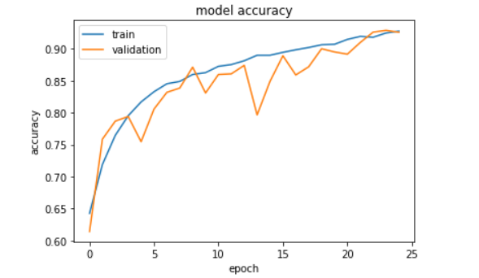

# CNN-with-Keras-
CNN with Keras on CIFAR-10 using Data Augmentation.

This is my attempt to train a modified version of vggnet(VGG-16) of the CIFAR-10 dataset which is a part of the tensorflow datasets
and comprises of images belonging to 10 classes.
Initially, the model was overfitting and the test accuracy was very low, but by adding data augmentation and dropout regularization, 
I was able to achieve an accuracy over 90%. The setting of hyperparameters is visible in the notebook.

This is a part of a Coursera guided project.

# Results

  
